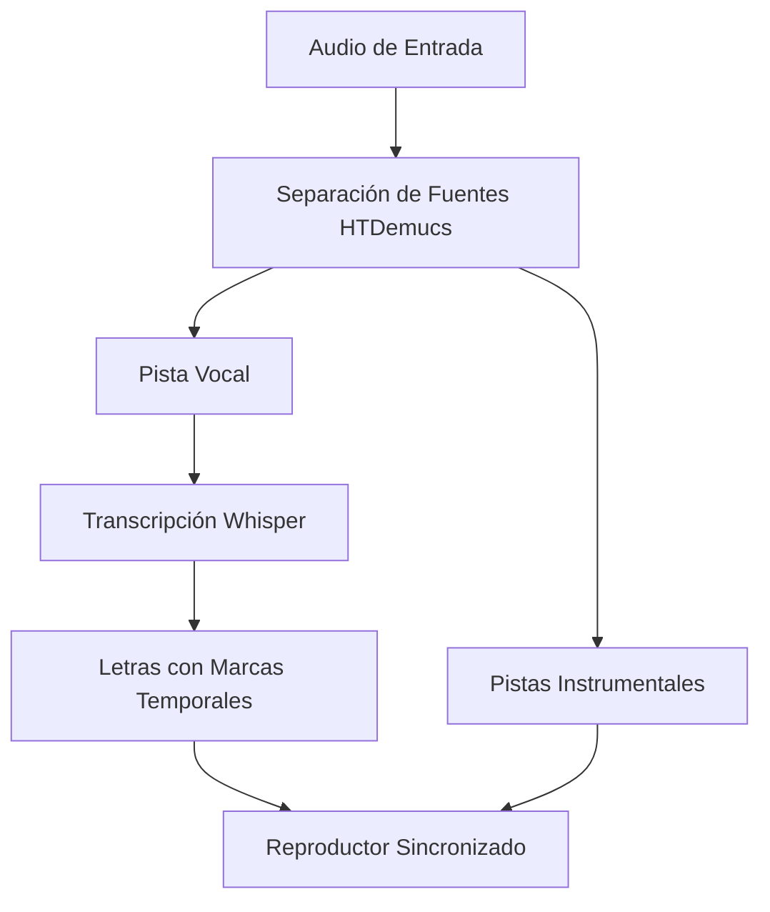

Aquí tienes un `README.md` profesional para tu proyecto Lyraoke-IA:

```markdown
# Lyraoke: Sistema de Karaoke en Tiempo Real con IA 🎤🤖

 <!-- Reemplazar con imagen real -->

Lyraoke es una aplicación innovadora que combina técnicas avanzadas de separación de fuentes musicales (HTDemucs) y reconocimiento automático de voz (Whisper) para crear una experiencia de karaoke automatizada en tiempo real.

## Características principales ✨

- 🎶 Separación de pistas vocales e instrumentales usando HTDemucs
- 📝 Transcripción automática de letras con marcas temporales usando Whisper large-v3
- ⏱️ Sincronización precisa de letras con la reproducción musical
- � Adaptación especial para música en español mediante fine-tuning
- 🖥️ Interfaz intuitiva para una experiencia de usuario fluida

## Instalación y Ejecución 🛠️

### Requisitos previos
- Python 3.12
- pip (última versión)
- Git (para clonar el repositorio)

### Pasos de instalación

1. **Clonar el repositorio**:
   ```bash
   git clone https://github.com/Alejandro-Dopico/Lyraoke-IA.git
   cd Lyraoke-IA
   ```

2. **Crear y activar entorno virtual** (recomendado):
   ```bash
   python -m venv venv
   # En Windows:
   venv\Scripts\activate
   # En Linux/MacOS:
   source venv/bin/activate
   ```

3. **Instalar dependencias**:
   ```bash
   pip install -r requirements.txt
   ```

4. **Ejecutar la aplicación**:
   ```bash
   python main.py
   ```
   *Nota: Los modelos de IA (HTDemucs y Whisper) se descargarán automáticamente durante la primera ejecución.*

## Uso de la Aplicación 🎧

1. Selecciona un archivo de audio (formatos soportados: .mp3, .wav, .flac)
2. Espera mientras el sistema procesa el audio (separación + transcripción)
3. ¡Disfruta del karaoke con letras sincronizadas!

## Arquitectura del Sistema �



## Resultados del Fine-Tuning 📊

| Métrica       | Modelo Original | Modelo Fine-Tuned | Mejora |
|--------------|----------------|----------------|-------|
| Voz (SDR)    | 8.17 dB        | 8.19 dB        | +0.02 dB |
| Batería      | 8.73 dB        | 8.79 dB        | +0.06 dB |
| Bajo         | 6.97 dB        | 7.04 dB        | +0.07 dB |

## Limitaciones y Trabajo Futuro 🔮

- 📈 Dataset pequeño para fine-tuning
- 🎮 Dependencia de GPU para uso en tiempo real
- 🔄 Integración de feedback de usuarios para corrección de letras

## Contribuciones 🤝

¡Las contribuciones son bienvenidas! Por favor abre un issue o pull request para sugerir mejoras.

## Cita este Proyecto 📚

Si usas Lyraoke en tu investigación, por favor cita:

```bibtex
@article{dopico2024lyraoke,
  title={Lyraoke: Sistema de Karaoke en Tiempo Real con Separación de Fuentes y Transcripción de Letras mediante IA},
  author={Dopico, Alejandro},
  journal={Revista de Inteligencia Artificial en Producción Musical},
  volume={1},
  number={1},
  pages={1--12},
  year={2024},
  url={https://github.com/Alejandro-Dopico/Lyraoke-IA}
}
```

## Licencia ⚖️

Este proyecto está bajo la licencia MIT - ver el archivo [LICENSE](LICENSE) para más detalles.
```

### Recomendaciones adicionales:

1. Añade capturas de pantalla reales de la aplicación en funcionamiento (reemplaza el placeholder)
2. Incluye un GIF breve mostrando el flujo de trabajo
3. Agrega una sección de "FAQ" si recibes preguntas frecuentes de usuarios
4. Considera añadir badges de estado (build, version, etc.) cuando el proyecto crezca

El README presenta tu proyecto de manera profesional, destacando sus aspectos técnicos innovadores mientras mantiene instrucciones claras para que los usuarios puedan probarlo fácilmente.