# Lyraoke: Karaoke en Tiempo Real con IA 🎤🤖

Lyraoke es una aplicación innovadora que combina técnicas avanzadas de separación de fuentes musicales (HTDemucs) y reconocimiento automático de voz (Whisper) para crear una experiencia de karaoke automatizada en tiempo real.

## Características principales ✨

- 🎶 Separación de pistas vocales e instrumentales usando HTDemucs
- 📝 Transcripción automática de letras con marcas temporales usando Whisper large-v3
- ⏱️ Sincronización precisa de letras con la reproducción musical
- � Adaptación especial para música en español mediante fine-tuning
- 🖥️ Interfaz intuitiva para una experiencia de usuario fluida

## Instalación y Ejecución 🛠️

### Requisitos previos
- Python 3.12
- pip (última versión)
- Git (para clonar el repositorio)

### Pasos de instalación

1. **Clonar el repositorio**:
   ```bash
   git clone https://github.com/Alejandro-Dopico/Lyraoke-IA.git
   cd Lyraoke-IA
   ```

2. **Crear y activar entorno virtual** (recomendado):
   ```bash
   python -m venv venv
   # En Windows:
   venv\Scripts\activate
   # En Linux/MacOS:
   source venv/bin/activate
   ```

3. **Instalar dependencias**:
   ```bash
   pip install -r requirements.txt
   ```

4. **Ejecutar la aplicación desde la raíz**:
   ```bash
   python app.py
   ```
   *Nota: Los modelos de IA (HTDemucs y Whisper) se descargarán automáticamente durante la primera ejecución.*

## Uso de la Aplicación 🎧

1. Selecciona un archivo de audio (formatos soportados: .mp3, .wav, .flac)
2. Espera mientras el sistema procesa el audio (separación + transcripción)
3. ¡Disfruta del karaoke con letras sincronizadas!

## Arquitectura del Sistema 🔧

```mermaid
graph TD
    A[Audio de Entrada] --> B[Separación de Fuentes HTDemucs]
    B --> C[Pista Vocal]
    B --> D[Pistas Instrumentales]
    C --> E[Transcripción Whisper]
    E --> F[Letras con Marcas Temporales]
    F --> G[Reproductor Sincronizado]
    D --> G
```



## Resultados del Fine-Tuning 📊

| Métrica       | Modelo Original | Modelo Fine-Tuned | Mejora |
|--------------|----------------|----------------|-------|
| Voz (SDR)    | 8.17 dB        | 8.19 dB        | +0.02 dB |
| Batería      | 8.73 dB        | 8.79 dB        | +0.06 dB |
| Bajo         | 6.97 dB        | 7.04 dB        | +0.07 dB |

## Limitaciones y Trabajo Futuro 🔮

- 📈 Dataset pequeño para fine-tuning
- 🎮 Dependencia de GPU para uso en tiempo real
- 🔄 Integración de feedback de usuarios para corrección de letras

## Contribuciones 🤝

¡Las contribuciones son bienvenidas! Por favor abre un issue o pull request para sugerir mejoras.

## Cita este Proyecto 📚

Si usas Lyraoke en tu investigación, por favor cita:

```bibtex
@article{dopico2024lyraoke,
  title={Lyraoke: Sistema de Karaoke en Tiempo Real con Separación de Fuentes y Transcripción de Letras mediante IA},
  author={Dopico, Alejandro},
  journal={Revista de Inteligencia Artificial en Producción Musical},
  volume={1},
  number={1},
  pages={1--12},
  year={2024},
  url={https://github.com/Alejandro-Dopico/Lyraoke-IA}
}
```

## Licencia ⚖️

Este proyecto está bajo la licencia MIT - ver el archivo [LICENSE](LICENSE) para más detalles.

## 🧩 Bibliografía

### Artículo Principal

Dopico, A. \[Alejandro]. (2024). *Lyraoke: Sistema de Karaoke en Tiempo Real con Separación de Fuentes y Transcripción de Letras mediante IA*. Revista de Inteligencia Artificial en Producción Musical, **1**(1), 1–12.
🔗 [https://github.com/Alejandro-Dopico/Lyraoke-IA](https://github.com/Alejandro-Dopico/Lyraoke-IA)

### Repositorios y Datasets

* [HTDemucs (Facebook Research)](https://github.com/facebookresearch/demucs)
* [Whisper (OpenAI)](https://github.com/openai/whisper)
* [MUSDB18-HQ Dataset (SigSep)](https://github.com/sigsep/sigsep-mus-db)
